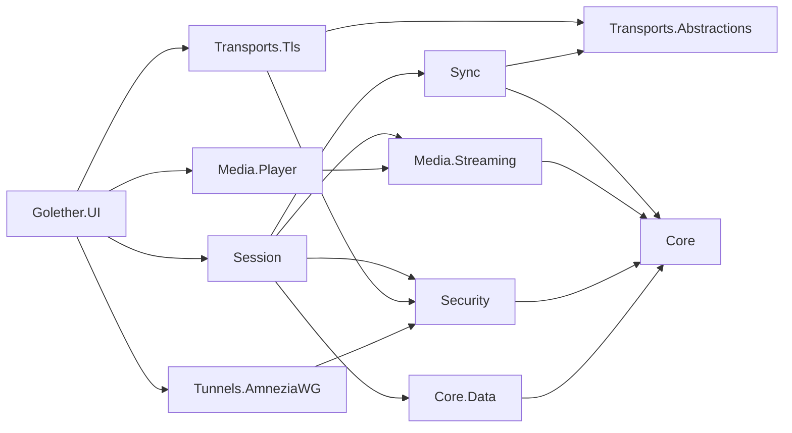

# Архитектура Golether

## Цель

Совместный просмотр видео с камерами участников:

- видео занимает большую часть окна, справа плитки участников (до 5 человек вместе с ведущим);
- у всех видео идёт синхронно; пауза, перемотка и старт от любого участника применяются у всех;
- при старте все начинают с одной позиции в один момент;
- файл не хранится на сервере: его раздаёт ведущий в исходном качестве;
- пинг больше 1000 мс допустим, лёгкий рассинхрон приемлем;
- посторонний не может подключиться; если прямой путь заблокирован, используется AmneziaWG.

## Решения

| Вопрос | Решение | Почему |
|---|---|---|
| Как передаётся видео | Передаётся исходный файл кусками по 4 МиБ, а не поток трансляции | Качество не теряется, пинг влияет только на время синхронизации |
| Плеер | libmpv (P/Invoke), собственный протокол `golether://` | Декодер FFmpeg, как у MPC, но работает на всех ОС и управляется точно |
| Транспорт | Взаимный TLS поверх TCP, закрепление ключей | `System.Net.Quic` не работает на Windows 10 и macOS; QUIC — будущая оптимизация |
| Синхронизация | Состояние задаётся временем, решения принимает ведущий, часы в духе NTP | Задержка доставки не влияет на результат |
| Безопасность | Ключ устройства ECDSA P-256, одноразовые приглашения, допуск ведущим, код сверки | Без удостоверяющего центра и сервера |
| Туннели | AmneziaWG «каждый с ведущим», пакеты «предложение / ответ» передают сами люди | Нет своего VPS |
| Камеры и голос | GStreamer `webrtcbin` | LGPL, WebRTC, захват и эхоподавление в одном фреймворке; SIPSorcery несовместим с GPL |
| Данные | SQLite, схема через FluentMigrator, доступ через EF Core | Требование проекта |
| Языки | Тексты лежат в JSON-файлах по одному на язык; код берёт текст по ключу из пакета выбранного языка | Новый язык — новый файл, ветвлений по языку в коде нет |

## Модули

```
Sources/
  Core/Golether.Core                       PeerId, PlaybackState, DriftCorrector, MediaDescriptor, PeerEndpoint, AppDataPaths
  Core/Golether.Localization               языки: JSON-файлы с текстами, выбор языка, Localizer и Texts
  Core/Golether.Core.Data                  EF Core: контакты, туннели, настройки
  Core/Golether.Core.Data.Migrations       FluentMigrator: миграции на SQL-скриптах и раннер
  Core/Golether.Core.Data.Migrations.SQLite SQL-скрипты и версии для SQLite
  Database/Golether.Dbs.SQLite.DbMigrator  консольный мигратор
  Security/Golether.Security               ключ устройства, защита секретов, приглашения, код сверки, допуск
  Transports/Golether.Transports.Abstractions  PeerStream, коннектор и листенер, FrameChannel
  Transports/Golether.Transports.Tls       mTLS поверх TCP с закреплением ключа
  Transports/Golether.Transports.PortMapping  проброс порта на роутере: NAT-PMP и UPnP IGD, продление аренды
  Transports/Golether.Transports.Relay     TURN-ретранслятор ведущего для камер и голоса (RFC 5766 поверх TCP)
  Sync/Golether.Sync                       протокол, оценка смещения часов, PlaybackAuthority, PlaybackFollower
  Media/Golether.Media.Streaming           сервер кусков, параллельный клиент, кэш, упреждающая загрузка, поток для плеера
  Media/Golether.Media.Player              libmpv (P/Invoke, встраивание, golether://), плеер-симулятор
  Media/Golether.Media.Conference          контракт камер и голоса, заглушка
  Media/Golether.Media.Conference.GStreamer  камеры и голос: захват, VP8/Opus, webrtcbin, микшер, эхоподавление
  Tunnels/Golether.Tunnels.AmneziaWG       ключи X25519, маскировка, .conf, подписанные пакеты, управление через CLI
  Session/Golether.Session                 HostSession и ParticipantSession
  Apps/Golether.UI                         Avalonia: окно, диалоги, композиция зависимостей
```

Зависимости направлены внутрь: Core ни от чего не зависит; UI собирает всё вместе в `AppServices`.



## Каналы между узлами

Каждый поток — отдельное TLS-соединение с преамбулой `GLTH`, версией и назначением:

- **Control** — JSON-сообщения сеанса (приветствие, состояние, часы, статусы), одно соединение на участника.
- **MediaData** — бинарные запросы кусков файла. Участник открывает до 4 параллельных соединений, чтобы на
  каналах с большим RTT скорость не ограничивалась одним TCP-потоком.
- **TURN** (порт сеанса + 1) — ретранслятор `Golether.Transports.Relay` для WebRTC (RFC 5766 поверх TCP, реле по
  UDP). Одноразовые учётные данные сеанса приходят участнику только в приветствии после допуска; ретранслятор
  пересылает пакеты лишь адресам, для которых клиент создал разрешение. Медиа при этом остаётся зашифрованным
  DTLS-SRTP, ведущий его не видит.
- **Модерация** — сообщение `moderate` от ведущего выключает микрофон и/или камеру участника; команды включения
  в протоколе нет. Состояние устройств участники сообщают в статусах (`MicrophoneOff`, `CameraOff`).

Подробности форматов: [Protocol.md](Protocol.md).

## Синхронизация

Состояние сеанса (`PlaybackState`): «в момент `ReferenceTime` по часам ведущего позиция была `Position`,
скорость `Rate`». Каждый узел вычисляет нужную позицию сам: `Position + (now − ReferenceTime) × Rate`.

- **Часы.** Участник отправляет пробы `ping/pong` (6 быстрых, затем каждые 2 с). Смещение
  `((t1 − t0) + (t2 − t3)) / 2` берётся из пробы с наименьшим RTT в окне из 16. Пока смещение неизвестно,
  состояние к плееру не применяется.
- **Решения.** `PlaybackAuthority` у ведущего принимает запросы всех участников в порядке прихода (последний
  выигрывает) и назначает версии. Узлы применяют только более новые версии.
- **Старт.** Play планируется на `now + max(RTT) + 1,5 с` (не больше 8 с), интерфейс показывает обратный отсчёт.
- **Пауза.** Инициатор ставит паузу у себя сразу и отправляет свой кадр; остальные переходят на него.
- **Без эха команд.** Намерения пользователя приходят только из команд интерфейса, события mpv не пересылаются.
  Поэтому действие, применённое по чужой команде, никогда не рассылается повторно.
- **Коррекция** (`DriftCorrector`):

| Расхождение | Действие |
|---|---|
| < 150 мс | ничего (если уже идёт коррекция — до 50 мс, гистерезис) |
| 150 мс – 2 с | скорость ±до 5 % за 8 с, высота звука сохраняется |
| > 2 с | точная перемотка; 1,5 с после перемотки коррекция не выполняется |

- **Конец фильма.** Когда ожидаемая позиция доходит до длительности, ведущий фиксирует паузу на последнем кадре
  (причина `Ended`). Последователь никогда не ждёт позицию дальше длительности и в конце не перематывает и не
  запускает плеер (mpv с `keep-open` сам встаёт на паузу). «Пуск» в конце запускает фильм с начала.
- **Буферизация.** Политика `WaitForAll`: если участник буферизует и отстал больше чем на 2 с, ведущий ставит
  всех на паузу и продолжает, когда у каждого есть ≥ 5 с данных. Альтернатива — `LetLaggardsCatchUp`.
- **Готовность перед стартом.** «Пуск» при политике `WaitForAll` сначала переводит всех в паузу на нужной позиции
  (причина `WaitingForParticipants`), пока у каждого участника не открыт файл и не загружено ≥ 5 с (у конца фильма —
  сколько осталось) на этой позиции. Дальше показ стартует сам (`ParticipantsReady`). Ведущий может не ждать
  (`PlayNow`), и через 45 секунд ожидание заканчивается само; обе причины — `StartedWithoutWaiting`.

## Чат, реакции, ручка и возврат в сеанс

- Сообщения чата, реакции и штрихи ручки идут по тому же TLS-каналу сеанса, что и синхронизация: ведущий проверяет
  содержимое, ограничивает частоту, подставляет проверенного отправителя и рассылает всем. На диск ничего не пишется.
- Реакции живут 3 секунды и рисуются в отдельном прозрачном окне поверх видео (иначе их закрыло бы окно mpv). На
  Windows это окно отвечает `HTTRANSPARENT` на проверку попадания, поэтому щелчки по видео проходят сквозь него.
  Окно держится открытым весь сеанс: у закрытого всплывающего окна привязки неактивны, и ушедшая реакция
  возвращалась бы при следующем открытии.
- То же окно накрывает всю область видео и несёт `StrokeCanvas` — холст ручки. Пока ручка отжата, окно остаётся
  прозрачным для мыши; при нажатии кнопки `ClickThroughWindow.SetClickThrough` перестаёт отвечать `HTTRANSPARENT`,
  и холст сам получает события указателя. `DrawingViewModel` копит точки и шлёт их пачками (~60 мс), а рисует
  только то, что вернул ведущий, — включая собственные штрихи, поэтому порядок у всех одинаковый.
- Координаты штриха — доли *картинки*, а не окна: `StrokeCanvas` считает прямоугольник кадра по соотношению сторон
  из mpv (`video-params/aspect`), поэтому при разной форме окон обведённое место совпадает. Цвет штриха — цвет
  участника из `ParticipantColors`, тот же, что у аватара.
- При приёме участник получает билет (`reconnectTicket`), действующий до конца сеанса. После обрыва `SessionService`
  пробует вернуться восемь раз с паузами 2, 3, 5, 10, 20 и 30 секунд; ведущий каждый раз подтверждает вход.

## Раздача файла

- `MediaDescriptor`: имя, размер, размер куска, быстрый идентификатор (SHA-256 от размера и трёх образцов по 1 МиБ).
- `ChunkServer` отдаёт куски с SHA-256; клиент проверяет хэш и длину.
- `RemoteChunkSource` устраняет дублирующиеся запросы, пересоздаёт упавшие потоки (3 попытки).
- `CachedMediaReader` хранит куски в памяти (LRU, 1 ГиБ) и качает на 32 куска вперёд пачками по 4.
- `MediaReadStream` отдаётся libmpv через `mpv_stream_cb_add_ro`; отмена чтения — через `cancel_fn`.
- Участник с тем же файлом (совпадает быстрый идентификатор) воспроизводит его с диска.
- **Индикатор загруженного.** Плеер сообщает, какие участки уже в кэше (`demuxer-cache-state` у mpv), и шкала
  показывает их светлой заливкой: видно, куда можно перемотать без ожидания. У ведущего и у участника со своей
  копией файла отмечена вся шкала.
- **Раздача между зрителями** (`Media.Streaming.Sharing`): участники объявляют друг другу, какие куски у них есть
  (кэш в памяти или вся локальная копия), и передают их по каналу данных WebRTC. `SwarmChunkSource` берёт кусок у
  участника, сверяет его SHA-256 с хэшем, который ведущий отдаёт без данных (операция GetHash), и при любой ошибке
  скачивает кусок у ведущего. Так ведущий отдаёт каждый кусок один раз, а не каждому зрителю.

## Безопасность

- **Устройство:** ECDSA P-256 и самоподписанный сертификат; `PeerId` = SHA-256 от SubjectPublicKeyInfo.
  Ключ хранится в `identity/device.key` под DPAPI (Windows) или с правами 600 (Linux/macOS, до перехода на
  libsecret/Keychain).
- **Приглашение:** `golether://join/v1/<base64url JSON>` с отпечатком ведущего, адресами, токеном на 128 бит и
  сроком. Токен одноразовый, хранится только его хэш.
- **Подключение:** участник закрепляет ключ ведущего при TLS-рукопожатии. Ведущий принимает любой сертификат,
  вычисляет `PeerId`, проверяет токен (доверенным контактам он не нужен) и спрашивает пользователя.
- **Код сверки:** три слова и число из обоих `PeerId` и контекста; стороны сравнивают его голосом.
- **Файл** отдаётся только допущенным участникам; при выходе, удалении или повторном подключении участника его
  потоки данных закрываются.
- **Камеры и голос** шифруются DTLS-SRTP. `webrtcbin` не сверяет сертификат собеседника с отпечатком из SDP,
  поэтому `WebRtcPeer` делает это сам: SDP приходит только по защищённому каналу сеанса, до совпадения сертификата
  кадры и звук не отправляются (`valve`) и не принимаются, при несовпадении соединение разрывается. Внешние
  STUN/TURN-серверы не используются.
- **Выключенные камера и микрофон** освобождаются: устройство останавливается, а не только перестаёт отправлять данные.
- **Входящие данные** (JSON, пакеты, конфигурации, имена файлов) проверяются и ограничены по размеру.

## Туннели AmneziaWG

- Ведущий держит один интерфейс `golether0` с подсетью `10.64–127.x.0/24`, у каждого участника свой peer `/32`.
- Предложение: открытый ключ AWG, адреса, назначенный адрес, общие параметры `S1/S2/H1–H4`, эфемерный ключ
  P-256, срок, сертификат устройства, подпись. Ответ: то же со стороны участника.
- PSK = HKDF-SHA256(ECDH(эфемерные ключи), соль = OfferId); по сети не передаётся.
- Закрытые ключи не покидают устройство; секреты в БД защищены `ISecretProtector`.
- Туннель поднимается через `amneziawg.exe /installtunnelservice` (Windows) или `awg-quick up` (Linux/macOS).
  Конфигурация экспортируется в формате, совместимом с AmneziaVPN.
- **Свой движок.** На Windows у приложения свой AmneziaWG: в пакет приложения он не входит, а скачивается по
  требованию как компонент `Tunnel` (кнопка «Установить» в окне «Туннели AWG»). Это официальный пакет
  `amneziawg-<arch>-3.1.0.msi`, закреплённый по SHA-256 и размеру, из которого `msiexec /a` достаёт
  `amneziawg.exe`, `awg.exe` и `wintun.dll` в `data/components/tunnel/<версия>/amneziawg`. В систему ничего не
  ставится и права администратора для распаковки не нужны. `ComponentLocator` намеренно **не** ищет AmneziaWG,
  установленный пользователем: Golether зовёт только свою копию, поэтому системный клиент и его туннели не
  затрагиваются. Если компонента нет, `AwgCliOptions.WindowsExecutable` возвращается к пути в Program Files.
  Тот же путь вычисляет и повышенный помощник `--tunnel-helper`, чтобы обе стороны звали одну программу.
  Путь ищется **перед каждым вызовом** (`AwgCliOptions.FindCarriedExecutable`), а не один раз при старте: компонент
  можно установить, не перезапуская приложение. Устанавливается он из окна «Туннели AWG», где показана карточка
  компонента; без движка `UpAsync` и `DownAsync` сразу дают понятную ошибку, а не сбой запуска процесса.
- Диапазон адресов туннелей `10.64–127.x.0/24` выбран так, чтобы не пересекаться с типовыми домашними сетями
  (`192.168.x`, `10.0.0.x`) и с туннелями, которые пользователь поднял сам.
- **Внешний адрес и пробивание NAT** (`NatTraversal`). Перед созданием предложения и перед принятием ответа сторона
  открывает UDP-сокет на порту будущего туннеля и спрашивает у публичных STUN-серверов, как этот порт виден
  снаружи. Адрес попадает в пакет, только если два сервера назвали **один и тот же** порт: разные означают
  симметричный NAT, и такой адрес бесполезен. Затем каждая сторона шлёт несколько пакетов по адресам другой с того
  же порта — первый пакет отбрасывается чужим роутером, но открывает дырку в своём, и рукопожатие проходит.
  Сокет закрывается прямо перед стартом туннеля: отображение роутера живёт заметно дольше.
- Список STUN-серверов задаётся в конструкторе `TunnelWorkflow`; пустой список полностью отключает обращения
  наружу (так работают тесты, и так можно поступить из соображений приватности).
- **Время жизни туннеля — время жизни приложения.** Имена поднятых интерфейсов пишутся в `data/tunnels/raised.txt`,
  при выходе `AppServices.DisposeAsync` опускает их (не дольше двух минут, отказ от запроса администратора не
  задерживает закрытие). Файл переживает аварийное завершение, поэтому забытый туннель снимет следующий запуск, а
  в окне туннелей есть кнопка «Опустить туннель» — не дожидаясь выхода. Туннели, поднятые не через Golether, не
  трогаются: в файле только свои.
- Порт интерфейса выбирается из диапазона 40000–60000 **с проверкой занятости**: он пересекается с портами, которые
  Windows раздаёт любым программам, и занятый порт означал бы и несостоявшийся туннель, и невозможность узнать
  внешний адрес.

## Языки интерфейса

Всё, что читает пользователь (экраны, диалоги, сообщения об ошибках, события сеанса, отчёт для диагностики), берётся
из языковых пакетов `Sources/Core/Golether.Localization/Languages/<код>.json` — плоский объект «ключ → текст», в
котором `Language.Code` и `Language.Name` называют язык (`ru` — «Русский», `en` — «English»). Пакеты вшиты в сборку;
`LanguageCatalog` находит их сам. Английский — язык по умолчанию и источник текстов, которых нет в другом языке.

Устройство:

- `ILanguagePack` — стратегия: тексты одного языка. `Localizer` ищет ключ в пакете текущего языка, затем в
  английском, затем возвращает сам ключ (пробел виден, экран не ломается). Он не спрашивает, какой язык включён.
- `Texts` (`Texts.Get(ключ)`, `Texts.Format(ключ, значения)`) — доступ для кода без модели представления:
  исключений, событий сеанса, подсказок. `Texts.Scope(...)` даёт потоку работы свой язык (нужен тестам).
- XAML: `Text="{loc:Loc Main.Title}"`, с подстановкой — `{loc:Loc Key=Main.Device, Arg={Binding Fingerprint}}`.
  Привязка идёт через `LocalizationSource`, поэтому все надписи меняются при смене языка сразу, без перезапуска.
  Тексты, которые модели представлений собирают сами, перечитываются в `MainWindowViewModel.RefreshTexts`.
- Ключи, зависящие от перечисления, строятся из его значений: `Session.Reject.<RejectReason>`,
  `Session.Playback.<PlaybackCause>`, `Component.Source.<ComponentSource>`, `Component.Stage.<InstallStage>`,
  `Log.Level.<LogLevel>`. Тесты следят, чтобы у каждого значения был текст в каждом языке.

Выбор языка (`LanguageService`, настройка `ui.language` в таблице `Settings`):

1. Первый запуск: в базе языка нет, берётся язык операционной системы (`CultureInfo.CurrentUICulture`), если для него
   есть пакет (сейчас — русский), иначе английский. Результат сохраняется и сразу показывается в списке языков.
2. Следующие запуски: язык читается из базы, система больше не опрашивается.
3. Пользователь выбирает язык в списке справа вверху (флаг `Assets/Flags/<код>.png` и название языка на нём
   самом); выбор применяется сразу и сохраняется.

Что не зависит от языка интерфейса:

- слова кода сверки (`VerificationCode`): обе стороны сеанса обязаны видеть одно и то же, поэтому список слов общий;
- по сети идут причины, а не тексты: `rejected` несёт `RejectReason`, `bye` — без текста; читатель формулирует
  причину на своём языке (ведущий и участник могут пользоваться разными языками);
- помощник туннелей и брандмауэра (отдельный процесс с правами администратора) языка не знает: он сообщает
  факты (программа, код выхода, вывод), а слова из них собирает приложение (`TunnelHelper.DescribeFailure`);
- сообщения ОС и .NET (`Win32Exception`, `HttpRequestException`) и вывод внешних программ показываются как есть;
  сообщения журнала разработчика (`ILogger`) остаются английскими, переводится только метка уровня в строке файла.

## Обновления и отчёты

- `UpdateService` читает манифест по адресу из настроек (`updates.url`, только `https://` или локальный адрес),
  сравнивает версию, скачивает файл и сверяет его SHA-256. Ничего не устанавливается само.
- `FileLogProvider` пишет журнал в `data/logs/golether-<дата>.log` (7 дней, до 8 МиБ в день), вырезая длинные
  шестнадцатеричные строки, ключи и пароли ретранслятора.
- `DiagnosticReport` собирает из этого отчёт: версия, система, компоненты, состояние сеанса (без названия файла) и
  хвост журнала.
- Установщик (`Scripts/golether.iss`, Inno Setup) ставит приложение в `%LOCALAPPDATA%\Programs\Golether` без прав
  администратора; папка `data` внутри установки не перезаписывается и удаляется только по отдельному согласию.

## Данные

Приложение автономно: `AppDataPaths` ищет маркер `golether.install` в папке программы и до трёх родительских
папок (пакеты кладут его в корень `Golether/`, рядом с `app/` или `Golether.app`) и хранит всё в `data` рядом с ним;
без маркера (сборка из `bin`) — в `data` рядом с исполняемым файлом. Профиль пользователя не используется;
данные ранних сборок из `%LOCALAPPDATA%\Golether` переносятся один раз. `GOLETHER_DATA_DIR` переопределяет путь
для разработки и тестов.

| Таблица | Содержимое |
|---|---|
| `Contacts` | известные устройства: имя, признак доверия, последний адрес, время |
| `HostTunnelInterfaces` | защищённые ключи и параметры интерфейса ведущего |
| `Tunnels` | предложения и туннели: роль, статус, адрес, peer, защищённые секреты |
| `Settings` | настройки (имя пользователя, язык интерфейса `ui.language`, громкость, устройства) |

Схема создаётся миграциями при запуске приложения или через `Golether.Dbs.SQLite.DbMigrator`.

## Этапы

| Этап | Состояние |
|---|---|
| Фундамент: решение, ядро, данные, безопасность, транспорт, синхронизация, раздача файла, плеер, UI, тесты, упаковка | **сделан** |
| Автоматическая установка компонентов (libmpv, GStreamer) в один клик | **сделан** |
| Камеры и голос: GStreamer `webrtcbin`, «каждый с каждым», эхоподавление `webrtcdsp` | **сделан** |
| Туннели без запуска программы от администратора (UAC-помощник, pkexec, osascript), выбор камеры и микрофона, сверка DTLS-сертификатов | **сделан** |
| Автоматический проброс порта ведущего (NAT-PMP, UPnP IGD) | **сделан** |
| Ретрансляция камер и голоса через ведущего (свой TURN поверх TCP), выключение устройств участника ведущим, громкость и щелчки по видео | **сделан** |
| Раздача кусков между зрителями по каналам данных WebRTC с проверкой по хэшам ведущего | **сделан** |
| Свои дорожки и субтитры у каждого, продолжение с места остановки, ожидание готовности перед стартом | **сделан** |
| Чат и реакции по каналу сеанса, громкость каждого участника, индикатор загруженного на шкале | **сделан** |
| Адаптивное качество камер по статистике соединения, автоматическое переподключение, отчёт для диагностики | **сделан** |
| Установщик для Windows (Inno Setup) и проверка обновлений по настраиваемому адресу | **сделан** |
| Заставка при запуске и ручка: рисование поверх видео, видное всем участникам | **сделан** |
| Правило брандмауэра Windows для входящих подключений (разовое подтверждение администратора) | **сделан** |
| Свой движок AmneziaWG в составе приложения (компонент `Tunnel`), не трогающий системный клиент | **сделан** |
| Внешний адрес через STUN в пакетах туннеля и пробивание NAT с порта туннеля | **сделан** |
| Туннель живёт, пока работает приложение: учёт поднятых и снятие при выходе | **сделан** |
| libmpv render API для macOS и Wayland, QUIC для Windows 11/Linux | запланирован |
| Хранилище секретов Keychain / libsecret, подписанные установщики | запланирован |

## Известные ограничения текущей сборки

- Камеры и голос идут напрямую, а если прямого пути нет — через TURN-ретранслятор ведущего (порт сеанса + 1).
  Для участников из других сетей этот порт тоже должен быть доступен: его открывает автоматический проброс на роутере
  или туннель AWG. Если роутер выдал другой внешний порт, ретрансляция из внешних сетей не заработает.
- Выключение устройств участника ведущим исполняет программа участника; изменённый клиент может его проигнорировать.
- Кто говорит, каждый участник определяет сам по уровню звука (`VoiceActivityDetector`: −42 dBFS, 60 мс на начало,
  450 мс удержания): свой голос — по отдельной ветке конвейера микрофона, чужие — по принятому звуку.
- На Windows mpv создаёт своё окно отключённым (`WS_DISABLED`), поэтому щелчки по видео ловит окно-контейнер
  `VideoHost` (подмена оконной процедуры); на Linux и macOS щелчки приходят через привязки ввода mpv.
- Качество камеры подстраивается под каждого участника: при потерях ≥ 5 % или круговой задержке ≥ 0,5 с (две пробы
  подряд, статистика `webrtcbin`) участник получает экономный поток 320×180 при 10 кадрах/с, а после пяти хороших
  проб возвращается обычный 640×360. Экономный кодировщик работает, только пока он кому-то нужен; переключение
  происходит на ключевом кадре.
- На macOS libmpv открывает собственное окно (нет встраивания без render API).
- Поверх области видео нельзя рисовать элементы Avalonia (airspace), поэтому подсказки показываются вместо видео,
  а реакции и штрихи ручки — в отдельном прозрачном окне, прозрачном и для щелчков (кроме включённой ручки).
- Пока приложение готовит данные и ключи, показывается заставка `SplashWindow`; главное окно создаётся уже готовым,
  поэтому пустой рамки с прозрачной областью больше не видно.
- Брандмауэр Windows считает новый адаптер (в том числе туннельный) общедоступной сетью и режет входящие, поэтому
  `WindowsFirewall` читает правила через COM-объект `HNetCfg.FwPolicy2` (прав не требует) и, если правила для этой
  копии нет, предлагает добавить его коротким запуском `Golether.exe --firewall-helper allow` через UAC. Правило
  одно и привязано к программе, а не к порту.
- Туннели меняются с правами администратора только на время операции: Windows — запуск `Golether.exe --tunnel-helper` через UAC, Linux — `pkexec`, macOS — `osascript … with administrator privileges`. Постоянной службы нет, поэтому каждое изменение туннеля требует подтверждения.
