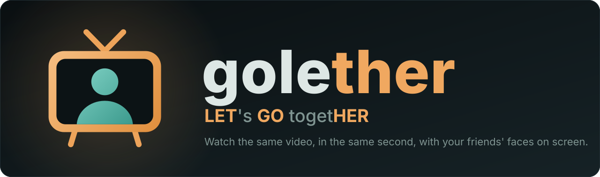
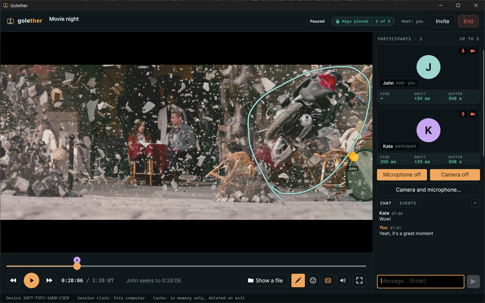

<p align="center">
  
</p>

<p align="center">
  <b>Watch movies together, in perfect sync, face to face.</b><br>
  One person plays the file. Everyone else sees the same frame at the same moment, with webcams and voice on the side.
</p>

<p align="center">
  
  
  
</p>

<p align="center">
  
</p>

## Let's go together

**Golether** = **GO** + **LET** + **HER**, hiding in the phrase "**LET**'s **GO** toget**HER**". That is the whole idea:
press play once and everybody goes along.

It is a free, open-source, **cross-platform** desktop app (Windows 10+, Linux on X11/Wayland, macOS 14+).
The host shows a video file in its original quality, up to five people watch together, and nobody has to upload,
transcode or install a server.

## Features

- **Truly synchronous playback.** Play, pause and seek work for everyone, in both directions. The protocol is
  designed for pings above 1000 ms, and "start" waits until every participant has the first seconds buffered.
- **Your own audio track and subtitles.** Each participant picks their own: one watches the original, another the
  dub, a third reads subtitles. You can also plug in your own `.srt`/`.ass` file or a separate audio track.
- **Reactions.** Send an emoji that floats over the video for everyone, with your name on it.
- **Draw on the screen.** Grab the pen and circle a detail: everyone sees the line as you draw it, in your colour.
  It fades after two seconds and stays attached to the picture, not to the window.
- **Webcams and voice** in one window: a tile for each person, echo cancellation, per-person volume, and a chat.
- **AmneziaWG tunnel, built in.** When the direct path is blocked, raise a tunnel between participants right from the
  app: no server of your own, no separate VPN client to set up.
- **Secure by default.** Device keys are pinned, the host admits every participant, and both sides compare a
  verification code aloud before anyone is let in. Invitations are single-use.
- **Instant start.** Open a video with "Open with → Golether", and a session is created for it. UPnP / NAT-PMP can
  open the port on your router automatically.
- **Resume where you stopped**, and a UI in English and Russian (a new language is one JSON file).

## Built with

| Area | Technology |
|---|---|
| Language and runtime | C# 14, .NET 10 |
| UI | Avalonia 12, MVVM ([CommunityToolkit.Mvvm](https://github.com/CommunityToolkit/dotnet)) |
| Video player | [libmpv](https://mpv.io/) (FFmpeg decoding), embedded through P/Invoke |
| Webcams and voice | GStreamer `webrtcbin` (VP8 / Opus, echo cancellation) |
| Networking | TLS transport, UPnP / NAT-PMP port mapping, [AmneziaWG](https://docs.amnezia.org/) tunnels |
| Security | Pinned device keys, TLS, X25519 keys for tunnels (NSec) |
| Storage | SQLite, EF Core, FluentMigrator |
| Tests | xUnit v3, NSubstitute |

## Installing and running

Packages are **self-contained**: the .NET runtime is inside, so there is nothing to install for .NET itself.
What else you need depends on the OS.

| | Windows 10+ | Linux (X11 / Wayland) | macOS 14+ |
|---|---|---|---|
| Package | `Golether-<version>-setup.exe` or `-win-x64.zip` | `.tar.gz` / `.zip` | `.tar.gz` / `.zip` with `Golether.app` |
| Video (libmpv) | included | install from your distribution: `libmpv2` or `mpv-libs` | `brew install mpv` |
| Webcams and voice (GStreamer) | included | `gstreamer1.0-plugins-{base,good,bad}` and `gstreamer1.0-nice` | `brew install gstreamer` |
| AmneziaWG tunnel | downloaded by the app on first use (about 4 MB, SHA-256 verified, no admin rights) | `amneziawg-tools` plus the `amneziawg` kernel module (or `amneziawg-go`) | `amneziawg-tools` |
| First start | SmartScreen warns until the build is signed | `./install-desktop-entry.sh` adds a menu entry | not notarized: *Privacy & Security → Open Anyway*, or `xattr -dr com.apple.quarantine Golether.app` |

- If libmpv is missing the app still starts, in a sync-only mode without a picture. The "Components" card on the
  start screen shows what is missing and, on Linux and macOS, a ready-to-copy terminal command. On Windows the
  same card has an **Install** button that downloads the pinned, checksum-verified package into the app's own data folder.
- Raising a tunnel asks the OS for permission (UAC on Windows, a password on Linux and macOS). The app itself never
  runs as administrator.
- The app is **portable**: keys, the database, tunnel configs, downloaded components and logs live in a `data`
  folder inside the installation, and nothing is written to the user profile. Move or delete the `Golether` folder as a whole.

## Building from source

Requirements: the **.NET SDK 10.0.100+** (see `global.json`) and, for video, libmpv.

```bash
dotnet build Golether.slnx
dotnet test --solution Golether.slnx
dotnet run --project Sources/Apps/Golether.UI
```

On Windows, fetch the native components for a debug run (they are copied next to the app on build):

```powershell
dotnet run --project Sources/Tools/Golether.Tools.Components -- fetch --output Native/win-x64 --cache artifacts/cache/components
```

On Linux and macOS install libmpv and GStreamer with the packages from the table above. For details see
[Native/README.md](Native/README.md).

| Variable | Purpose |
|---|---|
| `GOLETHER_LIBMPV` | explicit path to libmpv, overrides the search |
| `GOLETHER_DATA_DIR` | data folder for development and tests |

In VS Code the launch profiles live in `.vscode/launch.json`: "Golether: host", "Golether: participant" and their
combination, so two instances can be tried on one machine. Each profile builds only its own project with its dependencies.

## Under the hood

- The host serves the file in chunks over its own `golether://` protocol straight into libmpv. Participants hold the
  chunks in memory, or play their own copy of the same file from disk.
- The connection is TLS with pinned device keys. The host approves everyone after a spoken verification code.
  Ports can be opened via UPnP / NAT-PMP, or the participants can go through an AmneziaWG tunnel.
- Only reasons and codes travel over the network, never user-facing text: each side words them in its own language.
- Domain logic does not depend on UI, hosting or infrastructure; time comes from `TimeProvider` / `IMonotonicClock`,
  so tests are deterministic. Schema changes are FluentMigrator migrations only.

```
Sources/
  Apps/          the application (Golether.UI)
  Components/    native components: catalog, checksums, installer
  Core/          core, data and migrations, localization
  Database/      console database migrator
  Media/         player (libmpv), file serving, webcams and voice
  Security/      device keys, invitations, admission
  Session/       host and participant sessions
  Sync/          protocol and playback synchronization
  Transports/    TLS, relay, port mapping
  Tunnels/       AmneziaWG tunnels
Tests/           one test project per module
Docs/            documentation
Scripts/         packaging scripts
```

## Documentation

| Document | Audience |
|---|---|
| [Docs/UserGuide.md](Docs/UserGuide.md) | users: how to show a movie, invite people, raise a tunnel |
| [Docs/Architecture.md](Docs/Architecture.md) | design documentation: modules, synchronization, security, roadmap |
| [Docs/Protocol.md](Docs/Protocol.md) | network protocol and packet formats |
| [Docs/Development.md](Docs/Development.md) | developers: build, tests, debugging, packaging |
| [AGENTS.md](AGENTS.md) | code rules |

## Packaging

Output goes to `artifacts/publish/`. Windows (PowerShell):

```powershell
./Scripts/publish-win.ps1            # Golether-<version>-win-x64.zip, native components included
./Scripts/build-installer.ps1        # the same archive plus a Windows installer (needs Inno Setup 6+)
```

Linux and macOS (bash). Build on the target OS, so that executable permissions survive in the archive:

```bash
./Scripts/publish-linux.sh [linux-x64|linux-arm64]   # .tar.gz (+ .zip if zip is installed)
./Scripts/publish-macos.sh [osx-arm64|osx-x64]       # Golether.app with an ad-hoc signature
```

The `.sh` scripts are bash scripts, PowerShell cannot run them. On Windows use WSL and keep the repository in the
WSL file system (not under `/mnt/c`), for example `wsl bash Scripts/publish-linux.sh`. A macOS package must be built
on macOS (or a macOS CI runner): the icon and the ad-hoc signature come from `sips`, `iconutil` and `codesign`, which
exist only there, and without the signature an arm64 build will not start on Apple Silicon.

## License

GPL-3.0-or-later. All dependencies are GPL-compatible.
